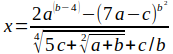

# Практика 1. Знакомство с языком

## Задание 1. Вставка кода JavaScript на веб-страницу

Вставить на веб-страницу инструкцию `console.log('hello, World')` 
тремя способами:

<ol type=a>
<li>в теге script
<li>в файле script.js, подключенном с помощью тега script;
<li>в атрибуте onclick элемента p.
</ol>

## Задание 2. Арифметические операции
Вычислить выражение и вывести результат в консоль браузера. Значения a и b ввести прямо в коде скрипта.

## Задание 3. Функция
Написать функцию, которая складывает значения из двух полей ввода. Для доступа к значениям использовать  
document.getElementById('id').value, где 'id' — значение атрибута id элемента input.
Функцию запускать при клике по кнопке (событие onclick).

## Задание 4. Доступ к элементам
Изменить решение Задания 2 таким образом, чтобы:
<ol type=a>
<li>значения a, b и c считывались из полей ввода; 
<li>результат выводить не в консоль браузера, а в элемент HTML с id='output'.
</ol>

В этом задании стоит обратить внимание на приведение типов.

Во всех следующих заданиях исходные данные также считываются из полей ввода.

## Задание 5. Вычислить значение
Вычислить значения выражений и вывести результаты в абзац текста. 
<ol type=a>
<li>|a — b|³
<li>(a / b) < 0
<li>sin(a) — tg(b)
</ol>

## Задание 6. Ветвление, if
<ol type=a>
<li>Определить, делится ли нацело число a на число b. Вывести «делится» или «не делится».
<li>Даны три диапазона значений: small — от 0 до 300, middle — от 301 до 1280 и big — от 1281 до бесконечности.  Определить, в какой диапазон входит введенное пользователем число.
<li>Решить квадратное уравнение вида ax² + bx + c = 0.
</ol>

## Задание 7. Строки
<ol type=a>
<li>Для введенной строки вывести «короткая», если она короче шести символов.
<li>Вывести «число» или «не число» в зависимости от того, что пользователь ввел в поле ввода.
<li>Подсчитать число пробелов в веденной строке. Поскольку циклы будут в только на следующей практике, то использовать, например, split().
</ol>